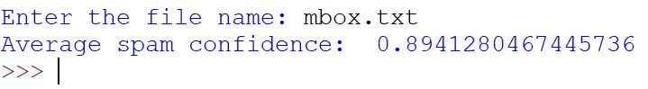
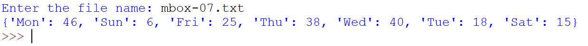

<!-- PROJECT LOGO -->

    
  </a>

  <h3 align="center">Forcasting Spam Emails</h3>

  

    We need to find a way to get rid of spammers.
     
    <a href="https://github.com/Mathurkarishma/forecast-spam-email"><strong>Explore the docs »</strong></a>
     
     
    <a href="https://github.com/Mathurkarishma/forecast-spam-email/issues">Report Bug</a>
    ·
    <a href="https://github.com/Mathurkarishma/forecast-spam-email/issues">Request Feature</a>
  

<!-- TABLE OF CONTENTS -->

  
<h2 style="display: inline-block">Table of Contents</h2>

  <ol>
    <li>
      <a href="#about-the-project">About The Project</a>
      <ul>
        <li><a href="#built-with">Built With</a></li>
      </ul>
    </li>
    <li>
      <a href="#getting-started">Getting Started</a>
    </li>
    <li><a href="#usage">Usage</a></li>
    <li><a href="#contact">Contact</a></li>
    <li><a href="#acknowledgements">Acknowledgements</a></li>
  </ol>

<!-- ABOUT THE PROJECT -->
## About The Project

Hackers are always waiting to see who their next victim is – the office worker who clicks on a link thinking it is a work related email or perhaps a teenager who receives an email stating they can receive a free smartphone in exchange for some personal information.  All of a sudden, this innocent scenario turns into a harmful virus or theft of one’s identity.  There are many ways stolen identification can occur, but one of the most common ways is through spam emails.  Our goal is to forecast which incoming email messages are spam and when we have likelihood to respond to them.

### Built With

* [Python 3](https://www.python.org/downloads/)
* [IDLE](https://docs.python.org/3/library/idle.html) (comes with Python)

<!-- GETTING STARTED -->
## Getting Started

To get a local copy up and running, download the `avg_spam_confidence.py` and `daily_email_count.py` Python files and the text input files, `mbox.txt`, `mbox-07.txt`, and `mbox-short.txt` into the same folder. Then run the code in an IDE software, such as IDLE, or in Command Prompt.  The `avg_spam_confidence.py` file isolates the numeric portion of a text file to output the average spam confidence.  The `daily_email_count.py` file counts emails that are sent out on a particular day of the week.

<!-- USAGE EXAMPLES -->
## Usage

Using the `mbox.txt` file in the `avg_spam_confidence.py` program in IDLE:

Using the `mbox-07.txt` file in the `daily_email_count.py` program in IDLE:

Using the `mbox-short.txt` file in the `daily_email_count.py` program in Command Prompt:

`>>python3 daily_email_count.py`  
`>>Enter the file name: mbox-short.txt`  
`>>{'Sat': 1, 'Fri': 20, 'Thu': 6}`

<!-- CONTACT -->
## Contact

Karishma Mathur - karishma324@gmail.com

Project Link: [https://github.com/Mathurkarishma/forecast-spam-email](https://github.com/Mathurkarishma/forecast-spam-email)

<!-- ACKNOWLEDGEMENTS -->
## Acknowledgements

* Dr. Prasanna Menta at [University of Maryland, Global Campus](https://www.umgc.edu/) - Fall 2019

<!-- MARKDOWN LINKS & IMAGES -->
<!-- https://www.markdownguide.org/basic-syntax/#reference-style-links -->
[contributors-shield]: https://img.shields.io/github/contributors/github_username/repo.svg?style=for-the-badge
[contributors-url]: https://github.com/github_username/repo/graphs/contributors
[forks-shield]: https://img.shields.io/github/forks/github_username/repo.svg?style=for-the-badge
[forks-url]: https://github.com/github_username/repo/network/members
[stars-shield]: https://img.shields.io/github/stars/github_username/repo.svg?style=for-the-badge
[stars-url]: https://github.com/github_username/repo/stargazers
[issues-shield]: https://img.shields.io/github/issues/github_username/repo.svg?style=for-the-badge
[issues-url]: https://github.com/github_username/repo/issues
[license-shield]: https://img.shields.io/github/license/github_username/repo.svg?style=for-the-badge
[license-url]: https://github.com/github_username/repo/blob/master/LICENSE.txt
[linkedin-shield]: https://img.shields.io/badge/-LinkedIn-black.svg?style=for-the-badge&logo=linkedin&colorB=555
[linkedin-url]: https://linkedin.com/in/github_username
